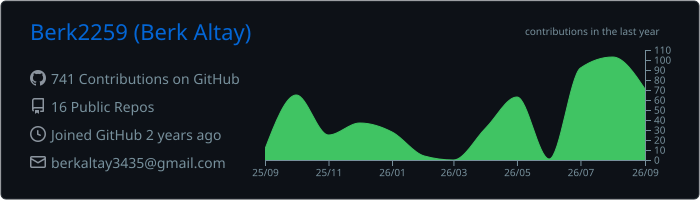

 

# Hi 👋 I'm Berk

I'm studying Computer Engineering, working on Flutter and backend development.

- 🎓 Computer Engineering Student
- 📱 Building user-focused mobile apps with Flutter
- 🛠️ Working with Python, Java and PostgreSQL on the backend
- 💼 Interning at Dijital Arı for 1 year
- 📫 Reach me: [LinkedIn](https://www.linkedin.com/in/berk-altay-46052a374/) · [Email](mailto:berkaltay3435@gmail.com)
- 🔗 [Website](https://berkaltay.com/)
- 📍 Tekirdağ · İzmir · Manisa, Turkey

### Technologies

| Mobile & Frontend | Backend & Languages | Database & Services | Tools |
|:--|:--|:--|:--|
|  |  |  |  |

### Contribution History

<table><tr><td>

</td><td>

</td></tr></table>

<table><tr><td>

</td><td>

</td></tr></table>
