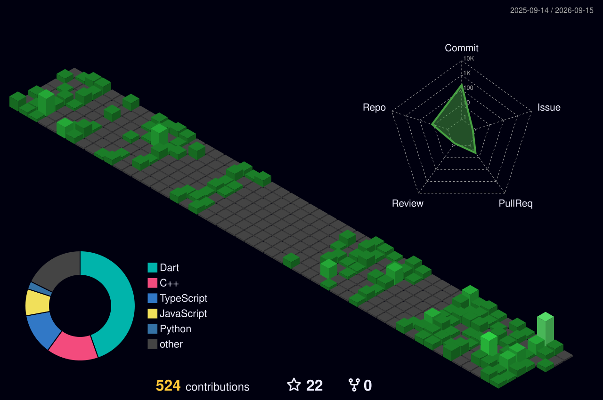

  

  Mobil uygulama geliştirme, backend teknolojileri ve modern yazılım geliştirme süreçleriyle ilgileniyorum. 
  Özellikle Flutter ile kullanıcı odaklı uygulamalar geliştiriyor, yeni teknolojiler öğrenerek kendimi sürekli geliştirmeye çalışıyorum.

  
  
  

 

## 🚀 Kullandığım Teknolojiler

## 🎯 Yetenek Radarım

  
  &nbsp;&nbsp;&nbsp;&nbsp;&nbsp;&nbsp;&nbsp;&nbsp;
  

---

## 📊 3D Katkı Grafiğim

  

---

## 🐍 Katkı Grafiğim

<picture>
  <source media="(prefers-color-scheme: dark)" srcset="https://raw.githubusercontent.com/Berk2259/Berk2259/output/github-contribution-grid-snake-dark.svg" />
  <source media="(prefers-color-scheme: light)" srcset="https://raw.githubusercontent.com/Berk2259/Berk2259/output/github-contribution-grid-snake.svg" />
  
</picture>

---

## 📈 İstatistiklerim

  

---

  

