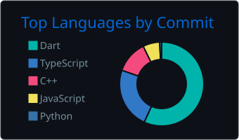

# Merhaba 👋 Ben Berk

Manisa Celal Bayar Üniversitesi Bilgisayar Mühendisliği 4. sınıf öğrencisiyim, Flutter ve backend geliştirme üzerine çalışıyorum.

- 🎓 Bilgisayar Mühendisliği Öğrencisi
- 📱 Flutter ile kullanıcı odaklı mobil uygulamalar geliştiriyorum
- 🛠️ Backend tarafında Python, Java ve PostgreSQL kullanıyorum
- 💼 Dijital Arı'da 1 yıl stajyerlik yaptım
- 📫 Bana ulaşmak için: [LinkedIn](https://www.linkedin.com/in/berk-altay-46052a374/) · [E-posta](mailto:berkaltay3435@gmail.com)
- 🔗 [Website](https://berkaltay.com/)
- 📍 Tekirdağ · İzmir · Manisa, Türkiye

 

### 🧩 Teknolojiler

<table>
<tr><th>Mobil & Frontend</th><th>Backend & Diller</th><th>Veritabanı & Servis</th><th>Araçlar</th></tr>
<tr>
<td align="center"></td>
<td align="center"></td>
<td align="center"></td>
<td align="center"></td>
</tr>
</table>

 

### 📊 Katkı Geçmişi

<table><tr><td>

</td><td>

</td></tr></table>

<table><tr><td>

</td><td>

</td></tr></table>
