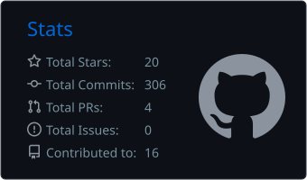

# Merhaba 👋 Ben Berk

Bilgisayar Mühendisliği bölümünde okuyorum, Flutter ve backend geliştirme üzerine çalışıyorum.

- 🎓 Bilgisayar Mühendisliği Öğrencisi
- 📱 Flutter ile kullanıcı odaklı mobil uygulamalar geliştiriyorum
- 🛠️ Backend tarafında Python, Java ve PostgreSQL kullanıyorum
- 💼 Dijital Arı'da 1 yıldır stajyerlik yapıyorum
- 📫 Bana ulaşmak için: [LinkedIn](https://www.linkedin.com/in/berk-altay-46052a374/) · [E-posta](mailto:berkaltay3435@gmail.com)
- 🔗 [Website](https://berkaltay.com/)
- 📍 Tekirdağ · İzmir · Manisa, Türkiye

### Teknolojiler

| Mobil & Frontend | Backend & Diller | Veritabanı & Servis | Araçlar |
|:--|:--|:--|:--|
|  |  |  |  |

### Katkı Geçmişi

<table><tr><td>

</td><td>

</td></tr></table>

