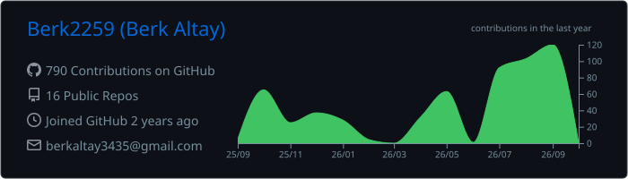
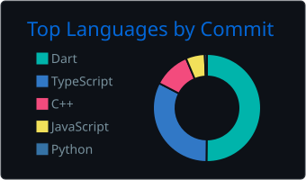

# Merhaba 👋 Ben Berk

Manisa Celal Bayar Üniversitesi Bilgisayar Mühendisliği 4. sınıf öğrencisiyim, Flutter ve backend geliştirme üzerine çalışıyorum.

- 🎓 Bilgisayar Mühendisliği Öğrencisi
- 📱 Flutter ile kullanıcı odaklı mobil uygulamalar geliştiriyorum
- 🛠️ Backend tarafında Python, Java ve PostgreSQL kullanıyorum
- 💼 Dijital Arı'da 1 yıl stajyerlik yaptım
- 🌍 Erasmus programıyla Polonya'da eğitim aldım
- 📫 Bana ulaşmak için: [LinkedIn](https://www.linkedin.com/in/berk-altay-46052a374/) · [E-posta](mailto:berkaltay3435@gmail.com)
- 🔗 [Website](https://berkaltay.com/)
- 📍 Tekirdağ · İzmir · Manisa, Türkiye

### 🧩 Teknolojiler

<table>
<tr><th>Mobil & Frontend</th><th>Backend & Diller</th><th>Veritabanı & Servis</th><th>Araçlar</th></tr>
<tr>
<td align="center"></td>
<td align="center"></td>
<td align="center"></td>
<td align="center"></td>
</tr>
</table>

### 📌 Öne Çıkan Projeler

<table width="100%">
<tr>
<td width="56" align="center" valign="middle"><h1>01</h1></td>
<td width="770" valign="middle">

🟣 **Portfolio**
 Next.js ve Supabase ile geliştirdiğim kişisel CV ve portfolyo sitem. Eğitim, deneyim, projeler ve teknik yeteneklerimi tek bir yerde sergiliyor; kendi yazdığım admin panelinden yönetiliyor. Responsive tasarım sayesinde her cihazda sorunsuz çalışıyor. Vercel üzerinden deploy edildi.

</td>
<td width="130" align="center" valign="middle"></td>
</tr>
<tr><td colspan="3">
</td></tr>
<tr>
<td width="56" align="center" valign="middle"><h1>02</h1></td>
<td width="770" valign="middle">

🟢 **LitFlow**
 LitFlow, edebi sözler, şiirler ve kısa düşünce metinlerini keşfetmeyi ve saklamayı sağlayan modern bir Flutter uygulamasıdır. Kullanıcılar günlük ilham verici sözleri görüntüleyebilir, favorilerine ekleyebilir ve kendi edebi koleksiyonlarını oluşturabilir.

</td>
<td width="130" align="center" valign="middle"></td>
</tr>
<tr><td colspan="3">
</td></tr>
<tr>
<td width="56" align="center" valign="middle"><h1>03</h1></td>
<td width="770" valign="middle">

🟠 **Price Tracker Bot**
 Admin panelden yönetilen, çok müşterili ve kategorili fiyat takip sistemi. Fiyat değişimlerinde Telegram üzerinden bildirim gönderir. Panel Next.js, bot Python ile yazıldı, veritabanı Supabase kullanıyor.

</td>
<td width="130" align="center" valign="middle"></td>
</tr>
</table>

### 📊 Katkı Geçmişi

<table><tr><td>

</td><td>

</td></tr></table>

<table><tr><td>

</td><td>

</td></tr></table>
